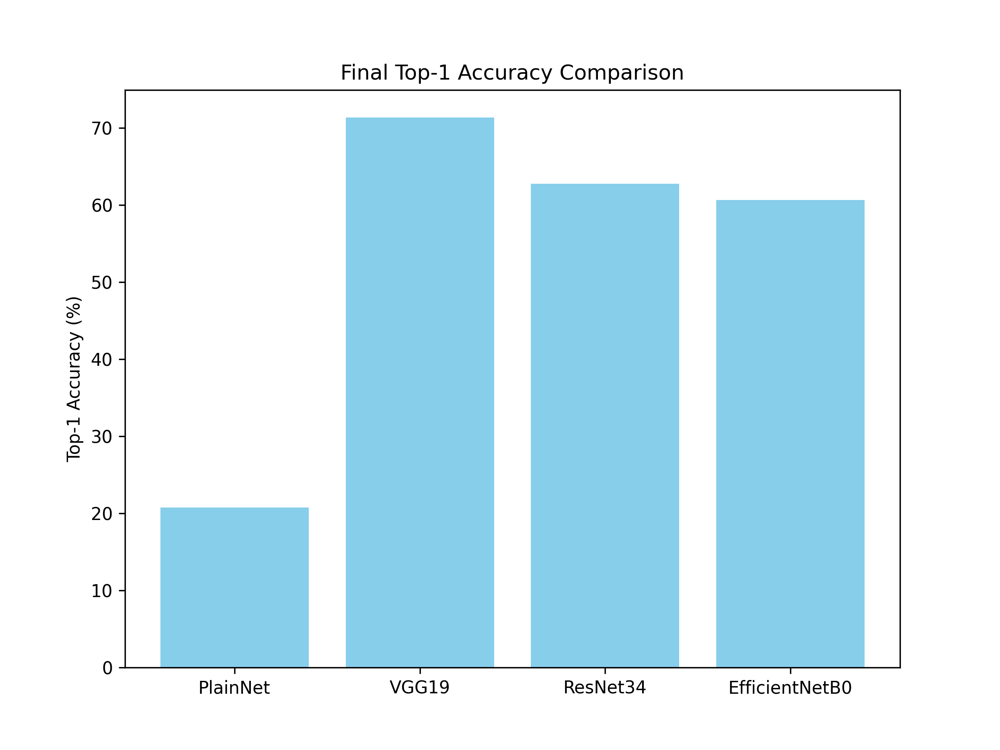
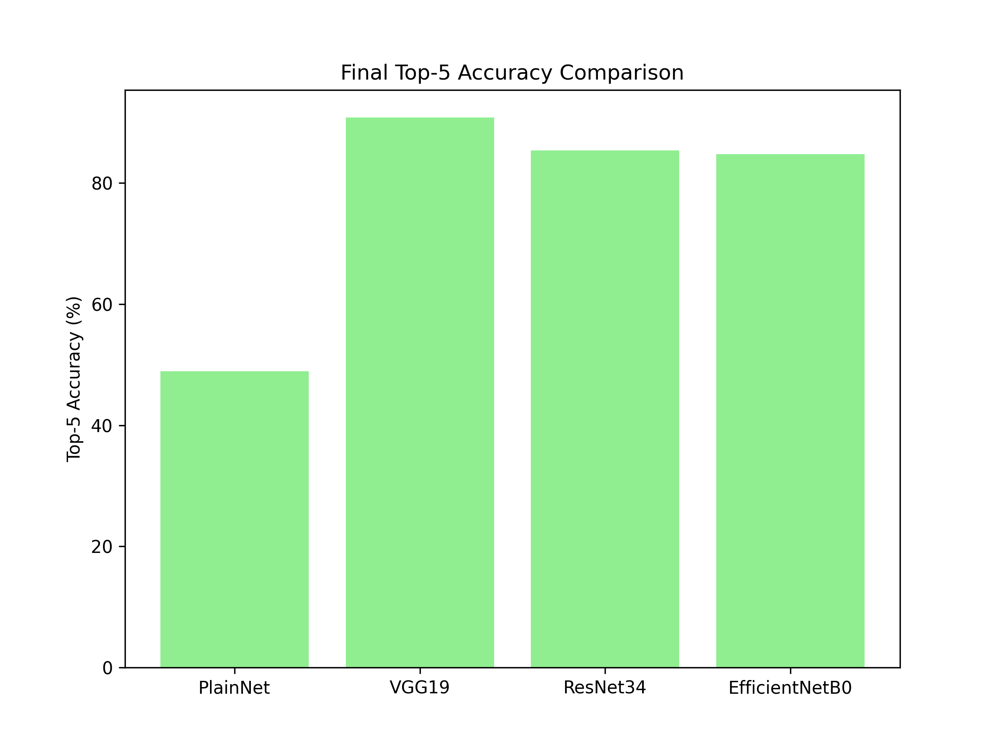
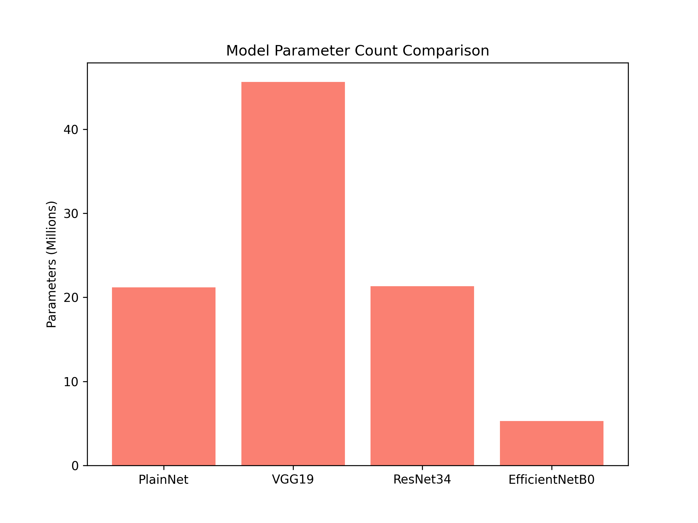
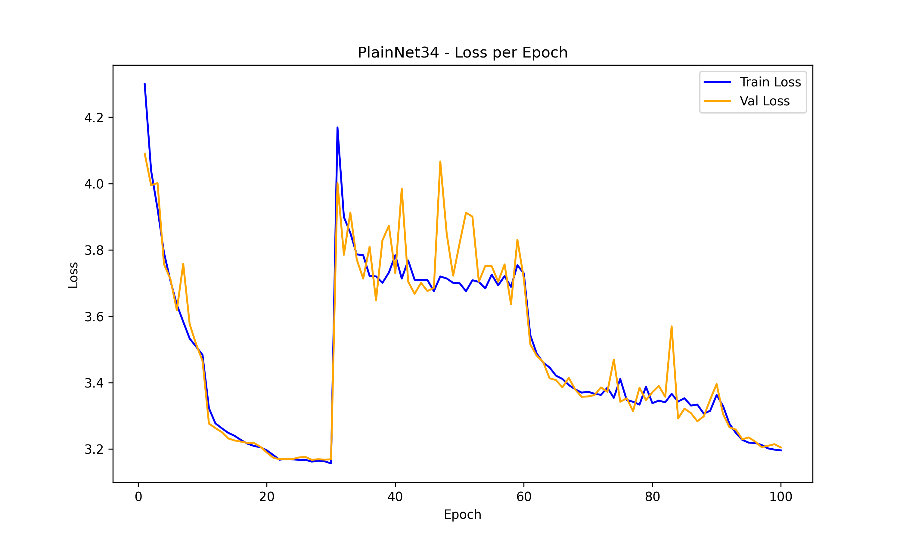
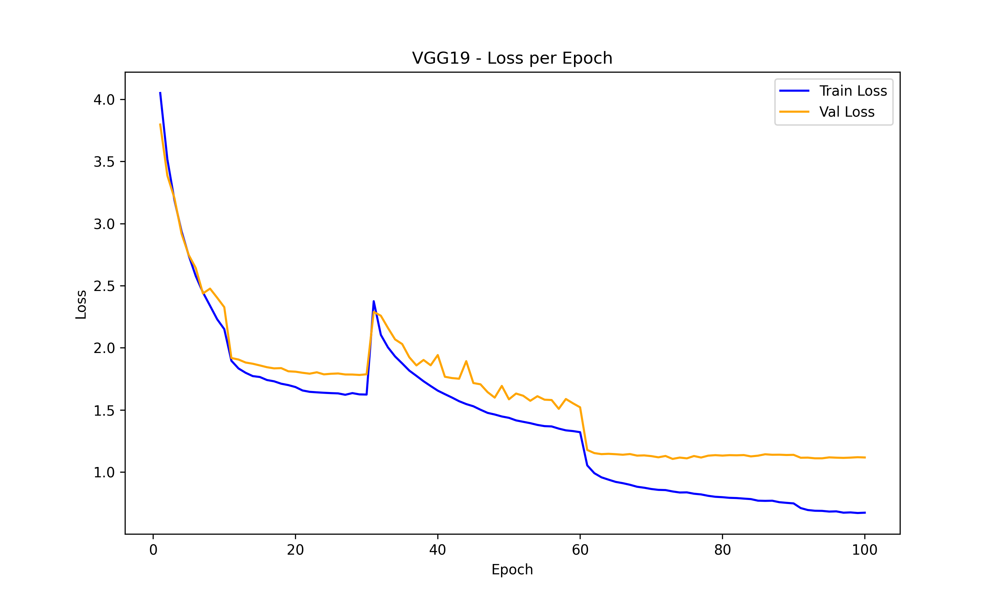
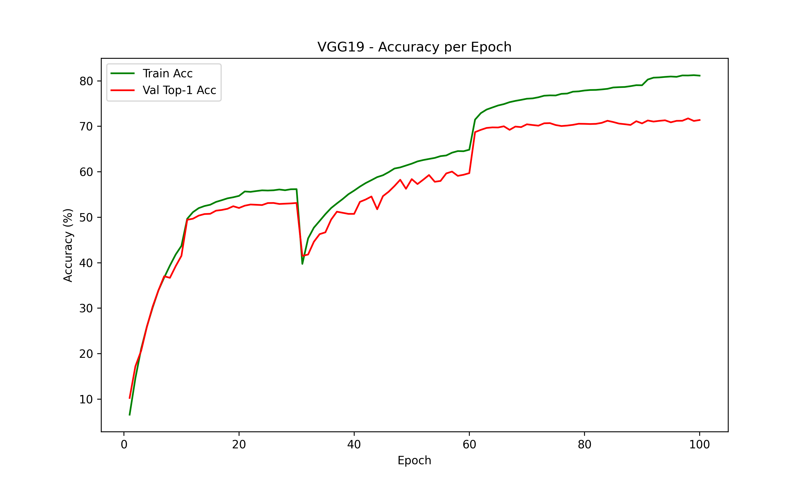
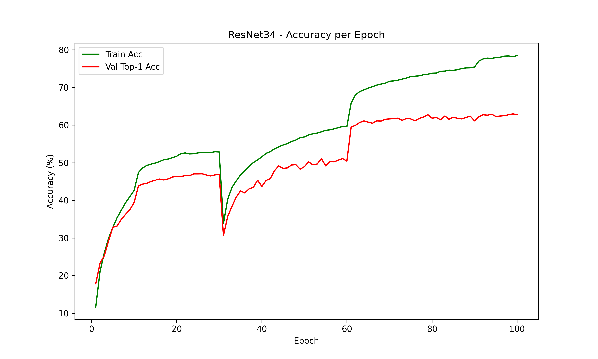
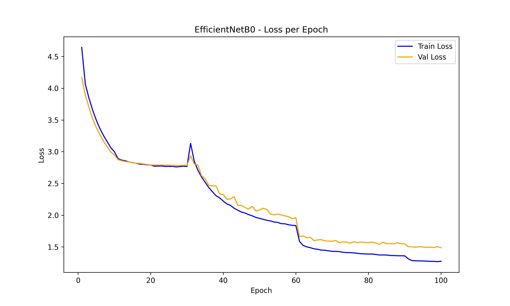
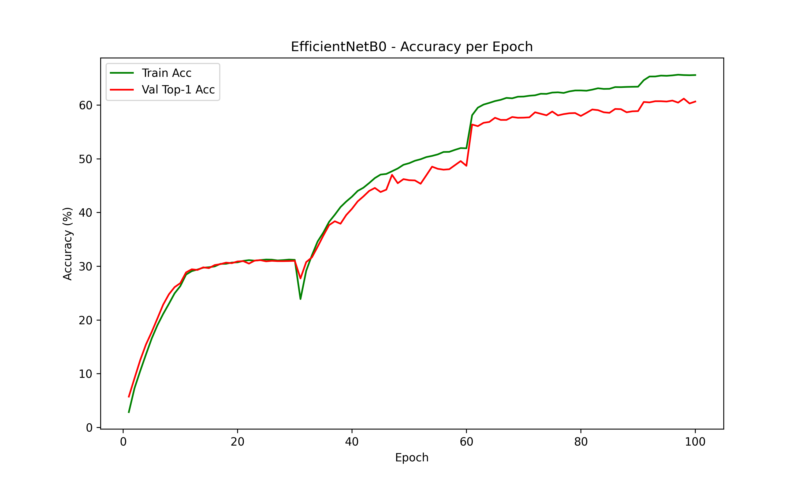

# 🖼️ ImageNet100 Model Comparison: PlainNet34, VGG19, ResNet34, EfficientNetB0

This project benchmarks four convolutional neural network architectures on the **ImageNet100** dataset (64×64 resolution), comparing their training dynamics, final accuracy, and parameter efficiency.

---

## 📌 Project Overview
The goal is to **compare the performance and efficiency** of multiple architectures on a standardized dataset and training pipeline.

**Models Compared:**
- **PlainNet34** — Baseline CNN with 34 layers
- **VGG19** — Deep VGG architecture
- **ResNet34** — Residual learning for deeper networks
- **EfficientNetB0** — Compound scaling architecture

---

## 📂 Dataset
- **Dataset:** ImageNet100 (100-class subset of ImageNet)
Download from here - https://www.kaggle.com/datasets/ambityga/imagenet100
- **Image Size:** 64×64
- **Normalization:** Computed from dataset statistics

---

## Purpose
- In ResNet, DenseNet and Efficient papers, the models are usually trained on Images with resolution 224*224 or higher but here due to computational limit, I can't train model on my hardware with resolution 224*224, so I observed how all the models will perform on Images with 64*64 resolution.I also tried to train on DenseNet model but due to too many connections/memory limitations, It was difficult to train on my device. Same for more deeper ResNet architectures, as the BottleNeck architecture didn't perform well on 64*64 Images because it was designed for 224*224 images, So It was taking too long to train the ResNet50/101 models.I was expecting performance in the order of EfficientNet> ResNet> VGG19> PlainNet34, but surprisingly VGG19 outperformed all other models.
[ResNet Paper](https://arxiv.org/abs/1512.03385)
[DenseNet Paper](https://arxiv.org/abs/1608.06993)
[EfficientNet Paper](https://arxiv.org/abs/1905.11946)

## ⚙️ Training Setup
- **Epochs:** 100  
- **Batch Size:** 128  
- **Optimizer Schedule:**
  - Adam (first 30 epochs) → SGD (remaining epochs)  
- **Learning Rate Schedule:** StepLR  
  - Adam: step=10, gamma=0.1  
  - SGD: step=30, gamma=0.1  
- **Loss Function:** CrossEntropyLoss  
- **Hardware:** RTX 4070 (8GB VRAM)

---

## 📊 Results

### **Final Top-1 Accuracy Comparison**


### **Final Top-5 Accuracy Comparison**


### **Parameter Count Comparison**


---

## 📈 Training Curves

### PlainNet34



### VGG19



### ResNet34



### EfficientNetB0



---

## 📄 Final Model Metrics

| Model         | Top-1 Acc (%) | Top-5 Acc (%) | Train Loss | Val Loss | Params (M) |
|---------------|--------------|--------------|------------|----------|------------|
| PlainNet34    | 20.74        | 48.88        | 3.196      | 3.205    | 21.17      |
| VGG19         | 71.36        | 90.80        | 0.673      | 1.117    | 45.62      |
| ResNet34      | 62.76        | 85.36        | 0.777      | 1.489    | 21.34      |
| EfficientNetB0| 60.64        | 84.76        | 1.273      | 1.487    | 5.00       |

---

## 🚀 How to Run

### 1️⃣ Clone Repository
```bash
git clone https://github.com/Aditya-043-nit/ImageNet100-Model-Comparison.git
cd ImageNet100-Model-Comparison
