# 🖼️ ImageNet-100 Model Comparison: PlainNet34, VGG19, ResNet34, EfficientNetB0

This project benchmarks four convolutional neural network architectures on the **ImageNet-100** dataset (64×64 resolution), comparing their **training dynamics**, **final accuracy**, and **parameter efficiency**.

---

## 📌 Overview

The aim is to **compare the performance and efficiency** of multiple CNN architectures under the same training pipeline and dataset constraints.

**Models Evaluated:**
- **PlainNet34** — Baseline 34-layer CNN
- **VGG19** — Classic deep convolutional network
- **ResNet34** — Residual learning framework for deeper networks
- **EfficientNetB0** — Compound scaling approach for balancing depth, width, and resolution

---

## 📂 Dataset

- **Dataset:** [ImageNet-100 (Kaggle)](https://www.kaggle.com/datasets/ambityga/imagenet100)  
  A 100-class subset of ImageNet with balanced class distribution.
- **Image Size:** 64×64
- **Normalization:** Mean and standard deviation computed from training data

---

## 🎯 Motivation

Most ResNet, DenseNet, and EfficientNet experiments are trained on **224×224** resolution images.  
Due to hardware limitations, this project evaluates performance on **64×64** images.

Key observations:
- DenseNet and deeper ResNets (e.g., ResNet50/101) were impractical due to memory and training time constraints.
- Bottleneck-based ResNets (designed for 224×224) did not adapt well to 64×64 resolution.
- Expected performance order: `EfficientNet > ResNet > VGG19 > PlainNet34`
- **Surprising outcome:** VGG19 achieved the highest accuracy.

📄 References:  
- [ResNet Paper](https://arxiv.org/abs/1512.03385)  
- [DenseNet Paper](https://arxiv.org/abs/1608.06993)  
- [EfficientNet Paper](https://arxiv.org/abs/1905.11946)  

---

## 🔄 Optimizer Switching Strategy

A noticeable dip in accuracy occurred around epoch 30 — this corresponds to **switching the optimizer from Adam → SGD**.

**Reason for switching:**
- **Adam:** Fast early convergence, adapts learning rates per parameter, robust to poor initialization.
- **SGD with momentum:** Better generalization, finds flatter minima.

**Workflow:**
1. **Epochs 1–30:** Adam — quickly reach a good region in parameter space.
2. **Epochs 31–100:** SGD — refine weights for better generalization.

---

## 🛠 Data Augmentation

| Augmentation         | Purpose |
|----------------------|---------|
| **RandomResizedCrop** | Vary scale & composition, robust to object size changes |
| **RandomHorizontalFlip** | Learn mirror-invariant features |
| **ColorJitter** | Handle lighting & color variations |
| **RandomRotation** | Robustness to small rotations |
| **Normalization** | Stable training & faster convergence |

---

## ⚙ Training Setup

- **Epochs:** 100  
- **Batch Size:** 128  
- **Optimizer Schedule:**
  - Adam (first 30 epochs) → SGD (remaining epochs)  
- **Learning Rate Schedule:** StepLR  
  - Adam: step=10, gamma=0.1  
  - SGD: step=30, gamma=0.1  
- **Loss Function:** CrossEntropyLoss  
- **Hardware:** RTX 4070 (8GB VRAM)

---

## 📊 Results

### Top-1 Accuracy
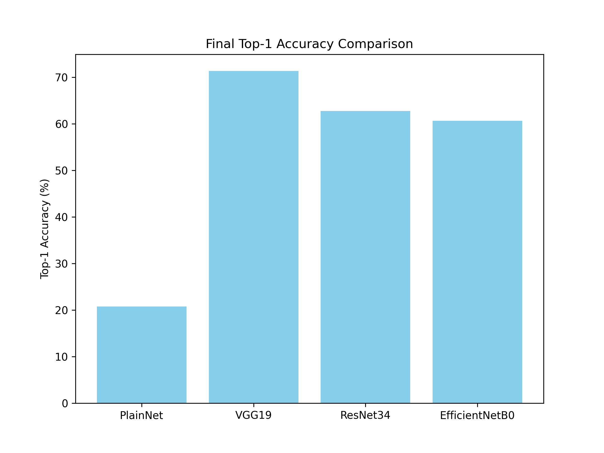

### Top-5 Accuracy
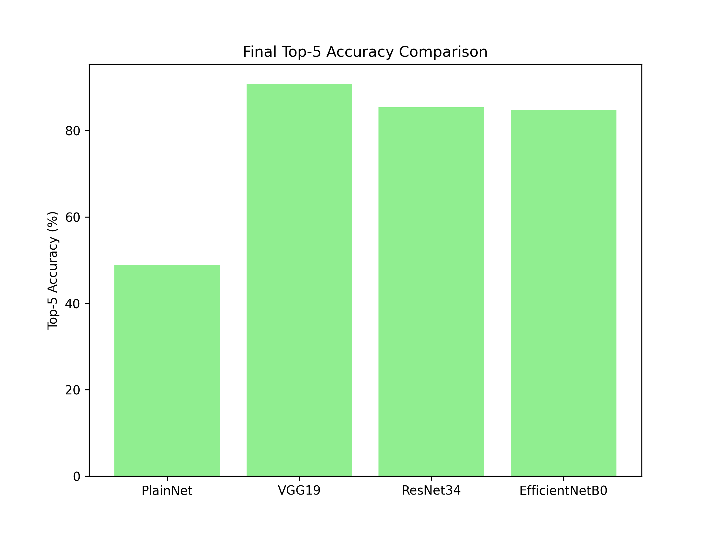

### Parameter Count
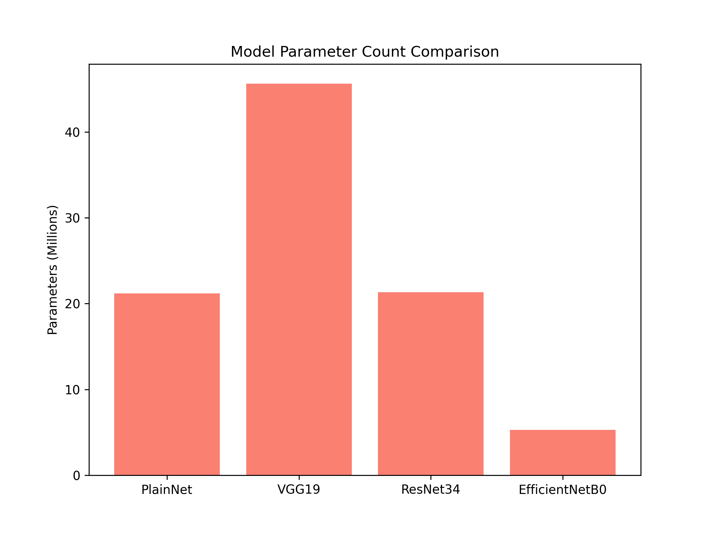

---

## 📈 Training Curves

**PlainNet34**  
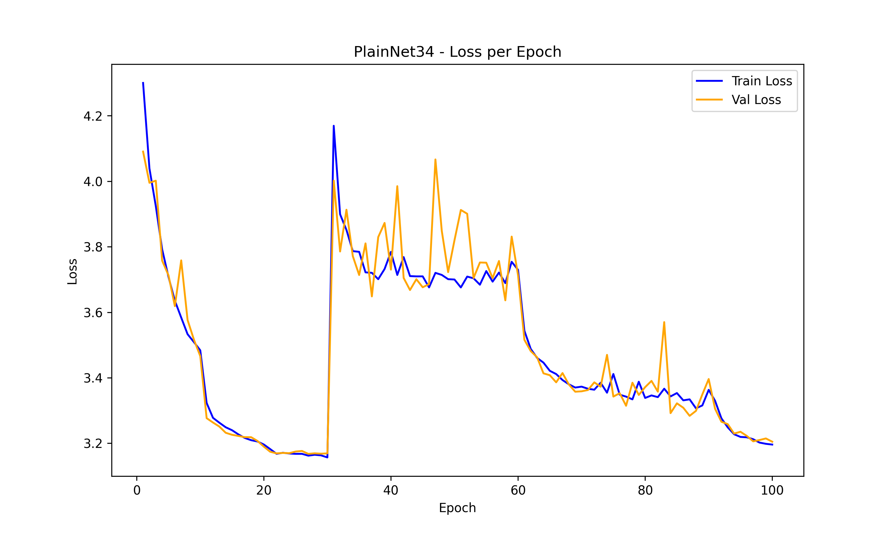  
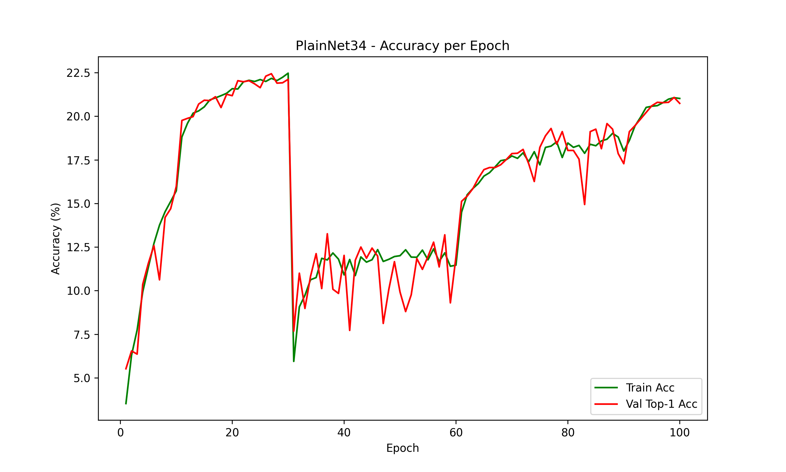  

**VGG19**  
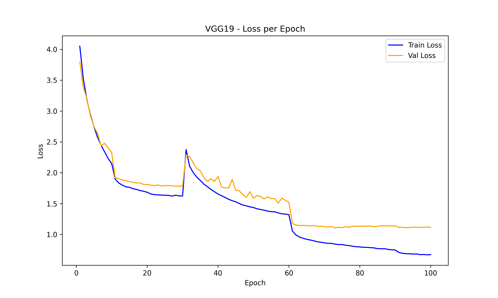  
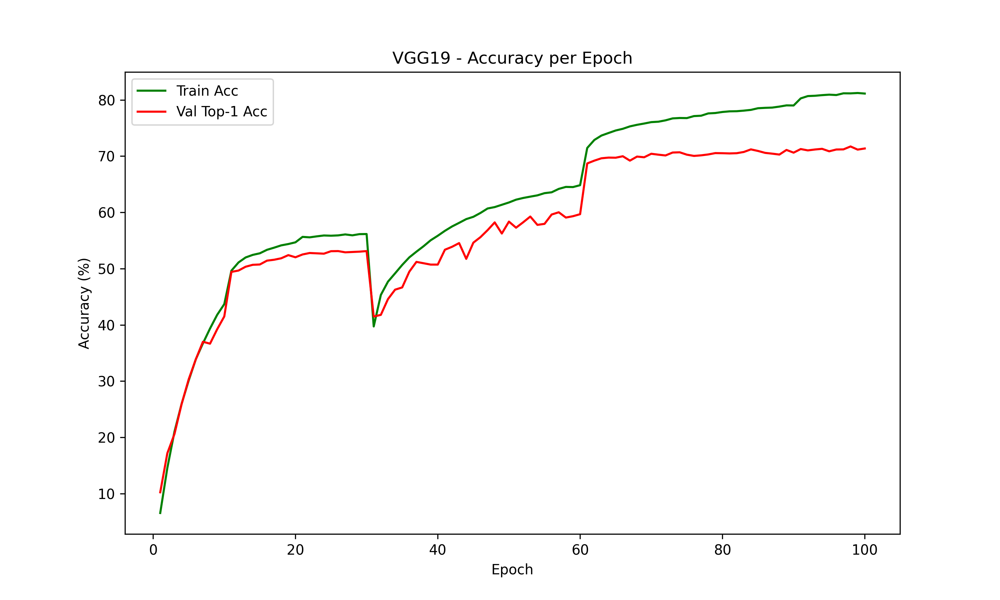  

**ResNet34**  
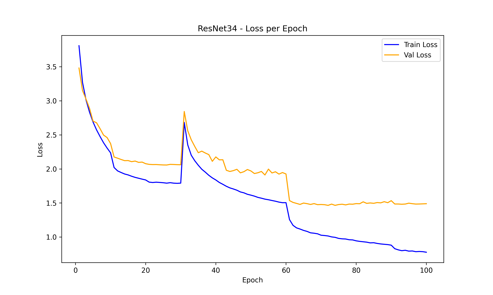  
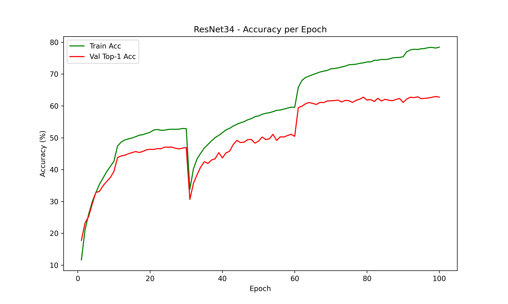  

**EfficientNetB0**  
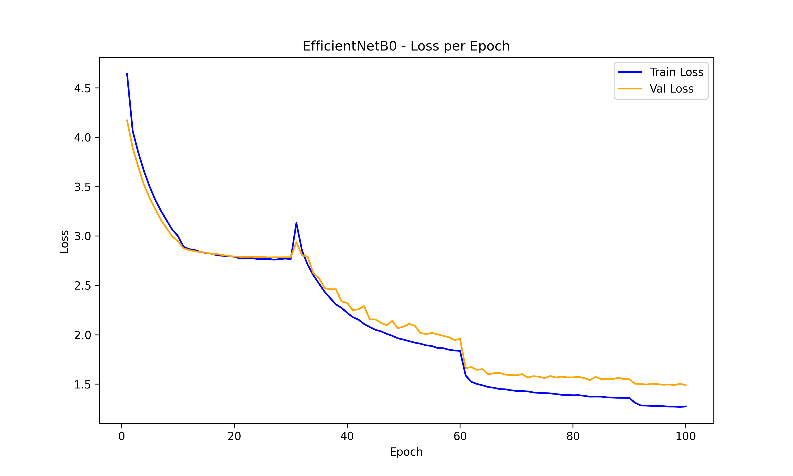  
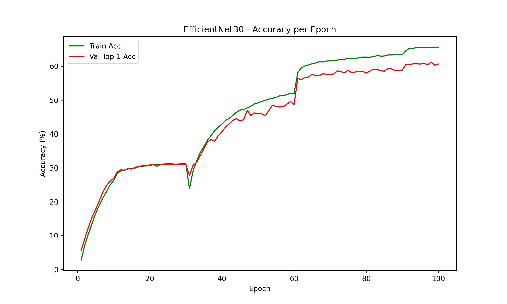  

---

## 📄 Final Model Metrics

| Model          | Top-1 (%) | Top-5 (%) | Train Loss | Val Loss | Params (M) |
|----------------|----------:|----------:|-----------:|---------:|-----------:|
| PlainNet34     | 20.74     | 48.88     | 3.196      | 3.205    | 21.17      |
| VGG19          | **71.36** | **90.80** | 0.673      | 1.117    | 45.62      |
| ResNet34       | 62.76     | 85.36     | 0.777      | 1.489    | 21.34      |
| EfficientNetB0 | 60.64     | 84.76     | 1.273      | 1.487    | 5.00       |

## Observation

I don't have a definitive explanation. My leading hypothesis is that the architectural assumptions behind ResNet34 and EfficientNetB0 were developed for higher-resolution inputs, whereas VGG19's simple stack of 3×3 convolutions may preserve useful information better at 64×64 resolution. However, I would need additional ablation studies to verify this.
---

## 🚀 How to Run

```bash
# Clone repository
git clone https://github.com/Aditya-043-nit/ImageNet100-Model-Comparison.git
cd ImageNet100-Model-Comparison

# Install dependencies
pip install -r requirements.txt
